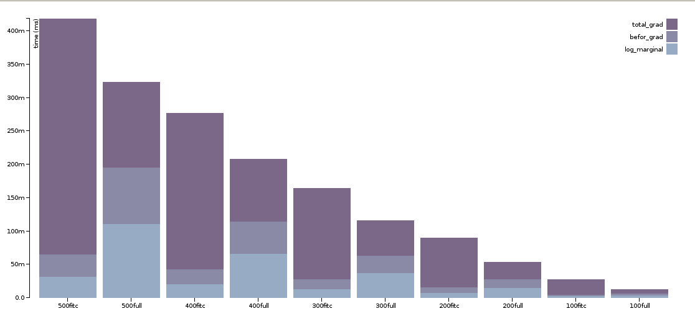
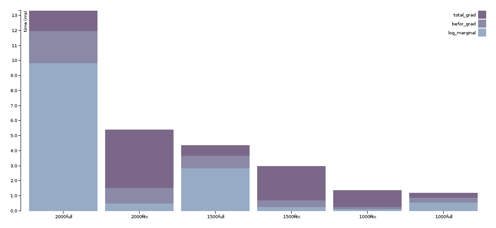
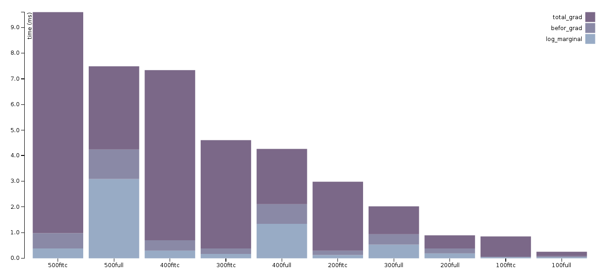
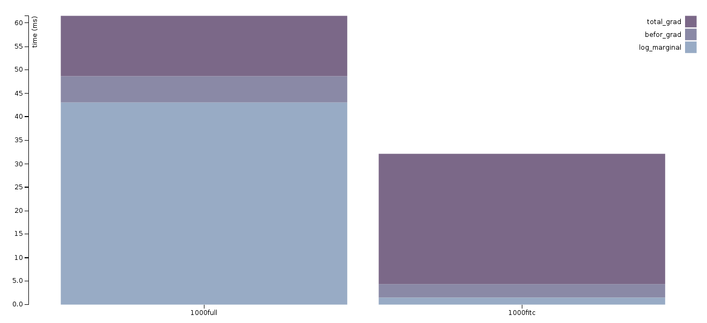

Times
=====

In this test we compared the performance of the library using two different methods.

- The first method is the Full GP which have a theoretical complexity of O(N ^ 3), where N represents the number of inputs.
- The second method is the FITC sparse approximation which have a theoretical complexity of O(N * K ^ 2), where N is the number of points and K is the number of "inducing points".

### Single output GP

In this test we fixed the number of inducing points to 30 and we used different values of N.

As noted in the first image, the FULL implementation is faster than the FITC approximation, this is due to the overhead of extra computations used in the FITC implementation.

In the second image we can see that the FITC implementation is faster than the FULL implementation. Based on the theoretical complexity we can  ensure that this will remain for larger sizes.

### Multi output GP

For multiple outputs it behaves as for a single output

